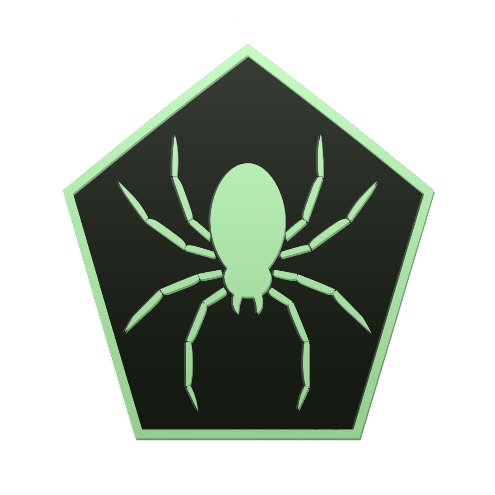

<p align="center">
  <a href="https://github.com/ToldByNun/sentinel">
    <picture>
      
    </picture>
  </a>
</p>

<h3 align="center">
Sentinel
</h3>

<p align="center">
  <a href="https://github.com/ToldByNun/sentinel/tree/main/docs">Docs</a> &bull;
  <a href="https://github.com/ToldByNun/sentinel">Sentinel</a> &bull;
</p>

**Sentinel** is a C++/CUDA library for **full-train** causal language models on a single consumer GPU — no LoRA, no PyTorch/TensorFlow runtime, no cuDNN.

You get a linkable C++ library (`Sentinel::sentinel`), small CLI examples, and a pip package (`sentinel-lm`, import name `sentinel`).

| | |
| --- | --- |
| **Engine runtime deps** | CUDA toolkit (cuBLAS / cuBLASLt), OpenMP, C++20 stdlib |
| **Not required at train/infer** | cuDNN, PyTorch, TensorFlow, other DL frameworks |
| **Python package** | Build needs scikit-build-core + nanobind + CMake + CUDA compiler; **no** extra PyPI runtime deps |

> The “zero-dependency” blurb means the **engine**, not the optional Python build toolchain.

## Install

### Python (`sentinel-lm`)

Needs a CUDA **13.x** toolkit on the build machine and at runtime (matching driver). On Windows, `import sentinel` adds `$CUDA_PATH\bin\x64` (and `bin`) via `os.add_dll_directory`.

```bash
# From a release / PyPI (when published):
pip install sentinel-lm

# From this repo:
pip install .
# Editable while hacking bindings:
pip install -e . --no-build-isolation
```

Windows tip: if pip cannot find CMake, use a VS *x64 Native Tools* shell, or prepend the VS CMake bin:

```powershell
$env:PATH = "C:\Program Files\Microsoft Visual Studio\18\Community\Common7\IDE\CommonExtensions\Microsoft\CMake\CMake\bin;$env:CUDA_PATH\bin;$env:PATH"
pip install -e . --no-build-isolation
```

Faster local wheel (your GPU only):

```bash
pip install . -C cmake.define.SENTINEL_CUDA_ARCHITECTURES=native
```

### C++ (CMake)

```bash
cmake -S . -B build -DCMAKE_BUILD_TYPE=Release
cmake --build build -j
cmake --install build --prefix /path/to/prefix
```

```cmake
find_package(Sentinel 0.1 REQUIRED)
target_link_libraries(my_app PRIVATE Sentinel::sentinel)
# #include "NeuralNet/Network/LanguageModel.hpp"
```

| Option | Default | Meaning |
| ------ | ------- | ------- |
| `SENTINEL_CUDA_ARCHITECTURES` | `75;80;86;89;120` | Fat binary (`native` = host GPU) |
| `SENTINEL_BUILD_SHARED` | `OFF` | Shared instead of static |
| `SENTINEL_BUILD_DEMO` | `ON` | `sentinel` harness (`main.cpp`) |
| `SENTINEL_BUILD_EXAMPLES` | `ON` | `sentinel_train_tiny`, `sentinel_generate` |
| `SENTINEL_BUILD_PYTHON` | `OFF` (`ON` via pip) | nanobind `sentinel._core` |
| `SENTINEL_INSTALL` | `ON` | Install / `find_package` export rules |

**Requirements:** Windows or Linux x86_64 · C++20 · CMake ≥ 3.24 · CUDA 13.x · GeForce 20/30/40/50 (`sm_75` … `sm_120`) · OpenMP · Python ≥ 3.10 only for the pip package.

## Quickstart (Python)

```python
import sentinel as S

tok = S.BPETokenizer()
tok.train(["the cat sat on the mat", "cuda packs batches"], vocab_size=256)
data = S.LanguageModelDataset.build(["the cat sat on the mat"], tok, maximum_token_count=48)

model = S.LanguageModel(tok.vocab_size, embedding_dim=64, maximum_position_count=64, learning_rate=3e-3)
if S.cuda_available():
    model.enable_cuda()
    model.set_prefer_flash_attention(True)
    model.enable_cuda_train()

model.train(data, epochs=4, batch_size=4)
model.save_safetensors("toy.safetensors")
print(tok.decode(model.generate(tok.encode("the"), new_token_count=16)))
```

```bash
python examples/python/train_tiny.py
python examples/python/generate.py tiny_demo.snlm "the cat"
python examples/python/train_jsonl.py examples/data/sample.jsonl --out run.safetensors
python examples/python/finetune_hf.py --demo --out hf_demo_out
```

## Quickstart (C++)

```bash
./build/bin/sentinel_train_tiny tiny_demo.snlm
./build/bin/sentinel_generate tiny_demo.snlm "the cat"
```

```cpp
#include "NeuralNet/Network/LanguageModel.hpp"
#include "NeuralNet/Data/LanguageModelDataset.hpp"
#include "NeuralNet/Tokenizer/BPETokenizer.hpp"
#include "NeuralNet/Optimizers/Adam.hpp"

BPETokenizer tok;
tok.train(corpus, 256);
auto train = LanguageModelDataset::build(corpus, tok, 48, false);
LanguageModel model(tok.vocabSize(), 64, 64, Adam(3e-3f), 2, 4);
model.enableCuda();
model.enableCudaTrain();
model.train(train, /*test=*/{}, 4, 1, 4, 1);
model.saveSafeTensors("toy.safetensors");
```

Streaming corpora (JSONL / HF Arrow): `LanguageModelChunkSource` + `train` / `train_chunks` on **C++ and Python** (`iter_train_chunks` / `take_train_chunk` helpers). JSONL fields: `problem_statement`, `text`, or `content`. See [examples/python/train_chunks.py](examples/python/train_chunks.py).

## Docs / Public API (v0.1)

Full reference:

| | |
| --- | --- |
| **[docs/](docs/README.md)** | Index |
| **[docs/python.md](docs/python.md)** | Python (`import sentinel`) |
| **[docs/cpp.md](docs/cpp.md)** | C++ (`Sentinel::sentinel`) |
| **[docs/huggingface.md](docs/huggingface.md)** | HF causal-LM import / export + tokenizer |

Treat those pages as the supported surface. The `sentinel` demo harness (`main.cpp`) is for smokes/benches — not the API contract.

**Python (summary):** high-level `LanguageModel` train / `train_chunks` / generate / I/O **plus** mid-level ops — `Matrix`, Attention/FFN/layers, `Adam`/`Spulse`, Softmax/CE, `accumulate_example`/`train_step`, `LanguageModelChunkSource` / `JsonlLoader`, SafeTensors helpers, `SentinelModelConfig`.

**C++ (summary):** `LanguageModel.hpp` (incl. `loadHuggingFace` / `loadGguf` / `loadSentinelModel`), `LanguageModelDataset.hpp`, `LanguageModelChunkSource.hpp` (streaming), `BPETokenizer.hpp`, `HfTokenizer.hpp`, `SafeTensors.hpp`, `Gguf.hpp`, `SentinelModelConfig.hpp`, `HuggingFaceConfig.hpp` / `HuggingFaceWeights.hpp` / `HuggingFaceResolve.hpp`, `CudaSbao.hpp`.

## Training knobs (short)

Defaults aim at **throughput when VRAM fits**. Large models on 16 GB typically need host offload.

| Knob | Notes |
| ---- | ----- |
| Flash attention | Prefer on (`set_prefer_flash_attention(True)`) |
| AMP | FP16 GEMMs when CUDA train is on |
| Pack budget | Auto from free VRAM; override with `set_max_packed_columns` |
| Activation ckpt | `Off` = fastest when acts fit; `Full`/`Selective` when VRAM-tight |
| **SBAO** | Auto: **GpuInt8Adam** if resident fit, else **HostFusedHalfAdam**, else **HostFusedHalfSgd** (e.g. ~4B on 16 GB) |
| **SPULSE** | Opt-in optimizer (not SBAO): dual-horizon energy-scaled momentum. `Hybrid` = hidden 2D + Adam aux; `Full` = all params (`set_spulse_coverage`). Host Hybrid keeps `u` on GPU + half-delta D2H. `u` storage: Fp32/Fp16/Int8 via `set_spulse_momentum_storage`. `set_prefer_spulse(True)` before `enable_cuda_train` |
| Weight tying | On (LM head shares token embedding) |
| CUDA graphs | Only with checkpointing **Off** and stable shapes |

HostSGD path (4B-style): FP16 weights on GPU, FP32 masters on host, fused FP16 grad D2H + async host SGD (no Adam `m`/`v`).

```python
model.set_prefer_host_sgd(True)          # or set_sbao_mode(S.SbaoMode.HostFusedHalfSgd)
model.enable_cuda_train()
model.set_activation_checkpoint_mode(S.ActivationCheckpointMode.Full)
```

## Checkpoints

| Format | Contents |
| ------ | -------- |
| `.snlm` | Native weights + optional optimizer (Adam/Muon) |
| `.safetensors` | Weights only, HF-compatible names + arch metadata |
| `.gguf` | GGUF v3 (llama.cpp names; F32 export, F32/F16/BF16 import) — see [docs/gguf.md](docs/gguf.md) |
| `model.json` / `.yaml` | Native `sentinel-model` arch config (+ optional `weights` path) |
| `.sbpe` | BPE tokenizer (`BPETokenizer::save` / `load`) — keep as `{stem}.sbpe` next to weights |

```python
model = S.LanguageModel.from_config("examples/configs/tiny.json")
model.save_checkpoint("run.snlm", include_optimizer=True)
model.save_safetensors("run.safetensors")
model.save_sentinel_config("run.json")  # weights left empty; set cfg.weights if desired
tok.save("run.sbpe")
model.load_checkpoint("run.safetensors")  # also accepts .safetensors
tok.load("run.sbpe")
```

## Performance (indicative)

Measured on **RTX 5070 Ti 16 GB** (WDDM). Desktop clocks and pack budget matter — re-measure after train-path changes. Paper / cross-lib runners: [`benchmarks/`](benchmarks/README.md).

| Shape | Setup | ~tok/s |
| ----- | ----- | ------ |
| ~60M (8×768) | Selective ckpt, int8 Adam, flash | ~18–20k |
| ~97M (12×768) | ckpt Off, int8 Adam, flash | ~25–26k |
| ~4B (34×3072) | HostFusedHalfSgd, Full ckpt, pack 8 @ seq 512 | ~950–1000 |

Probe: `benchmarks/_lib/probe_4b_safe.py` or `LanguageModel.probe_cuda_packed_train_tokens_per_second`.

## Layout

| Path | Role |
| ---- | ---- |
| `CMakeLists.txt` / `cmake/` | Library, install, `find_package(Sentinel)` |
| `pyproject.toml` / `python/sentinel/` | pip package `sentinel-lm` |
| `sentinel/NeuralNet/` | Engine sources |
| `sentinel/main.cpp` | Smoke / scale harness (not public API) |
| `examples/` | C++ + Python usage (no external data required) |
| `docs/` | Python + C++ API reference |
| `benchmarks/` | Paper comparisons + 4B probe |

## Publishing wheels

Workflow: [`.github/workflows/publish.yml`](.github/workflows/publish.yml) — sdist + cp310–cp312 wheels (Linux manylinux + Windows), CUDA 13 on the runner. Publish on GitHub Release or `workflow_dispatch`. Wheels do **not** bundle the CUDA runtime.

## Verify

```bash
cmake -S . -B build -DCMAKE_BUILD_TYPE=Release && cmake --build build -j
./build/bin/sentinel_train_tiny
./build/bin/sentinel_generate tiny_demo.snlm "the cat"
python examples/python/train_tiny.py
```

## Contributing

See [CONTRIBUTING.md](CONTRIBUTING.md). Changes that touch the CUDA train path should include a before/after probe — no speculative “speed” stacks without a measured keep/revert gate.

## License

MIT — [LICENSE.md](LICENSE.md).
